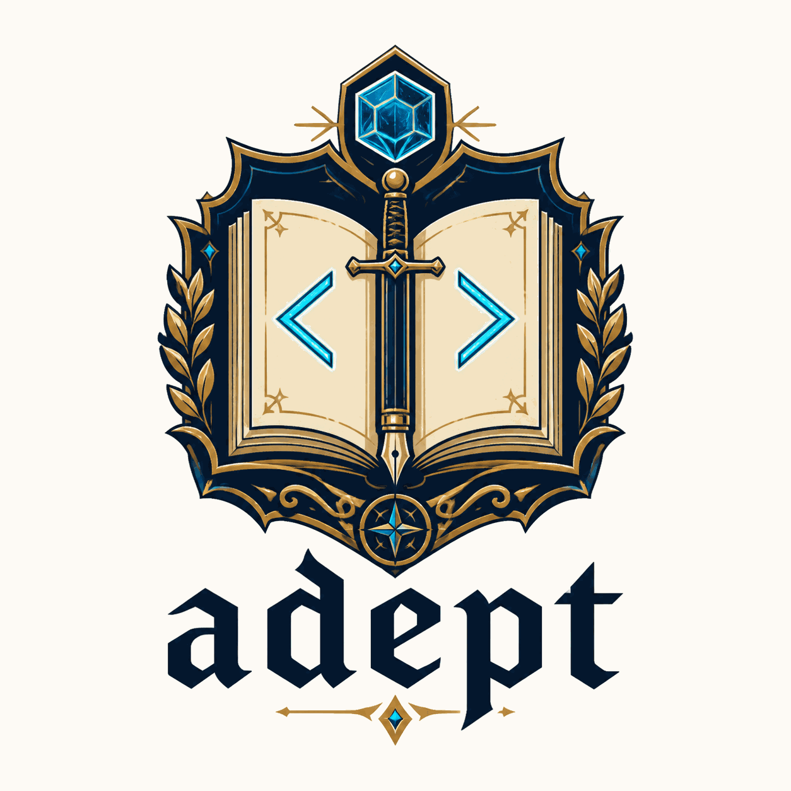
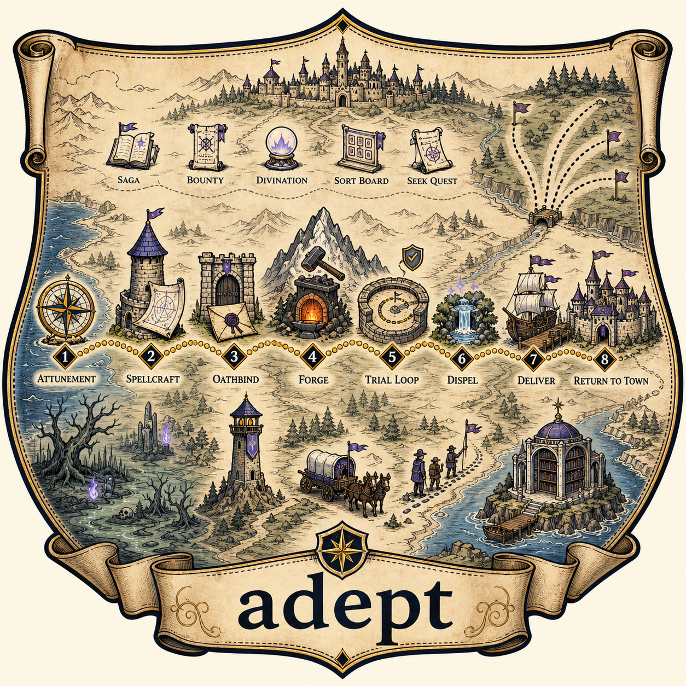

# adept

Development-workflow skills for Claude Code and Codex, distributed as a plugin. You
give a coding agent a GitHub issue number; adept walks it from scoping through design,
review, and a merge-ready pull request, and leaves the state of that work on GitHub
where the next session — or the next person — can pick it up.

## What makes adept different

**Work state lives on GitHub, not in a session.** Every phase writes what it decided
back to the issue: a frozen scope charter before design starts, a review summary on the
pull request, a trajectory note when something parks. Labels track where each issue
actually is. Close the terminal mid-run and the next session reads the issue and knows
where the work stopped — there is no local database, no session file, nothing to lose.

**Design is reviewed adversarially before the code exists.** A non-trivial change writes
a specification and an architecture decision record, then hands each to a *fresh*
reviewer whose brief is to attack it — one that has not seen the reasoning that produced
it, and whose first job is to reproduce the document's factual claims rather than take
them. Findings get dispositioned one at a time, and the loop re-reviews until it
converges or stops and says why. The same loop runs again on the finished branch.
Defects are cheapest in the spec, then the plan, then the source, and this is what
spends the effort there.

**The vocabulary names the phase, not the tool.** `/quest` an issue, `/forge` the build,
run the `/gauntlet` over it, `/dispel` what's overcomplicated, `/deliver` it, then
`/return-to-town`. The D&D framing is deliberate and it earns its keep: the names are
memorable, they're distinct enough that an agent picks the right one from a description,
and they say what stage you're at instead of which library is involved.

## Install

Claude Code:

    claude plugin marketplace add randomparity/adept
    claude plugin install adept@randomparity

Codex CLI:

    codex plugin marketplace add randomparity/adept
    codex plugin add adept@randomparity

Start a new Codex session after installing so the bundled skills are available.

There is no install script and there will not be one — the harness owns install, update,
uninstall, and caching. [ADR 0001](docs/adr/0001-distribution-via-plugin-marketplace.md)
records why.

To update: `claude plugin update adept@randomparity`, or
`codex plugin marketplace upgrade randomparity`. Every change to this repository bumps
the manifest version, so every merge to `main` is a real update — a CI gate refuses a
change that leaves the version alone
([ADR 0022](docs/adr/0022-versioned-manifest-and-bump-gate.md)).

## Quick start

adept keeps pipeline state in GitHub labels, so the first run in a repository starts by
creating them. In your project, with an issue you want implemented:

    /sort-board          # bootstraps the status:/type:/priority: labels, triages the backlog
    /quest 42            # takes issue #42 from scoping to a merge-ready PR

`/quest` does not run start to finish silently. It stops where a human is the only one
who can answer, and it records everything else. What you see, in order:

1. **Preflight.** It reads your `AGENTS.md` or `CLAUDE.md`, finds the default branch and
   the guardrail commands, and checks the working tree is clean.
2. **Scope.** It restates the issue's requirement in its own words and asks you — one
   question at a time — about anything genuinely ambiguous that would change the design.
   Your answers get frozen into a scope charter posted on the issue. Nothing later in
   the run may widen it.
3. **Design.** For non-trivial work it writes a spec and an ADR, has both attacked by a
   fresh reviewer, fixes what survives, then writes an implementation plan and does it
   again. Trivial changes skip straight to the build.
4. **Build.** Test first: the failing test, the confirmation that it *does* fail, then
   the smallest implementation that passes. Guardrails green at every commit.
5. **Review.** The whole branch goes to an adversarial reviewer — auth, data loss,
   races, rollback, degraded dependencies, and whether a simpler approach was available.
   If the diff touches a trust boundary, a security pass runs on top. You see a verdict,
   not a wall of findings.
6. **Ship.** It pushes, opens the PR, drives it to green CI and mergeable state, and
   hands it to you with the review summary attached. It does not merge unless you told
   it to.

If something blocks — a guardrail that won't go green, a design question only you can
settle, a review finding it can't resolve — the run parks: it writes what happened and
what it needs onto the issue, labels it `status:needs-human`, and stops. It does not
guess and carry on.

Not sure which issue to start with? `/seek-quest` ranks the ready queue and recommends
one. Have a feature that's too big for one PR? `/saga` interviews it into an epic with
dependency-ordered sub-issues, and `/campaign` runs the whole set.

## What ships

Skills, grouped by what you reach for them for. The full one-page table — which skill
for which situation — is the [cheat sheet](docs/cheatsheet.md).

| Group | What's in it |
|---|---|
| **End-to-end** | `quest` drives one issue through the whole pipeline; `campaign` drives a set of them, in parallel where safe, merging serially |
| **Planning** | `saga` turns an idea into an epic; `bounty` files a verified issue; `divination` sizes one; `sort-board` triages a backlog; `seek-quest` picks what's next |
| **Design** | `attunement` reads the repo's conventions, base branch, and guardrail commands before anything runs; `spellcraft` writes and hardens the spec, ADR, and plan; `oathbind` audits the finished design against its frozen scope before any code |
| **Build & review** | `forge` builds test-first; `trial-loop` runs review-and-fix until it converges; `gauntlet` is a one-shot hostile review; `detect-evil` is the security pass; `detect-curse` root-causes a failure before you change anything; `dispel` simplifies; `summon-swarm` fans high-volume generation out to parallel Codex workers |
| **Shipping** | `deliver` opens the PR and drives CI green; `return-to-town` hands off or merges; `counterspell` reverses a merged PR that turned out bad |
| **Hygiene** | `resurrection` reconciles stale labels; `clear-map` prunes landed branches; `restock` handles Dependabot; `warding` sweeps for maintenance work |
| **Knowledge** | `grimoire` records a hard-won solution; `bards-tale` mines the workflow telemetry into a retrospective |

Two conventions are consulted rather than run: `quest-log` defines the `status:*` label
state machine and the `WORK:*` annotation comments, and `tome-of-lore` defines the
decision- and deferral-record formats plus the CI gate that keeps them honest.

`claude plugin details adept` prints the current inventory and its projected token cost.
`codex plugin list --json` confirms Codex has it installed and enabled.

Two MCP servers ship alongside: `context7` and `exa`. The `exa` server reads `EXA_API_KEY`
from the session environment at start; without the key you get a failing server you can
disable, and nothing else depends on it.

## The pipeline

Each step keeps the guardrails green before the next one starts, and a blocked step
parks the issue rather than skipping ahead.

The pipeline ends at a merge-ready pull request. There is no release stage — no tagging,
changelog, or deploy — and that is a decision rather than a gap;
[ADR 0006](docs/adr/0006-release-management-out-of-scope.md) records it, including the
condition that would reopen it.

## Working on this repository

    just verify     # the guardrail suite: gates, suites, linters, manifests
    just hooks      # once per clone: installs prek and the pre-push hook

To try un-pushed changes in Claude Code without installing anything:

    claude --plugin-dir ./

`/reload-plugins` picks up edits inside a running session.

For Codex CLI, add the checkout as a local marketplace and install it:

    codex plugin marketplace add ./
    codex plugin add adept@randomparity

Rerun `codex plugin add adept@randomparity` after edits to refresh Codex's cached copy,
then test in a new session. See the
[OpenAI plugin documentation](https://learn.chatgpt.com/docs/plugins) for the current
Codex plugin workflow.

`CLAUDE.md` carries the rules that govern what may ship here — in particular that a skill
is instructions rather than a program, that no skill runs a long-lived process, and that
nothing automated asserts on prose.

## Licence

MIT — see [LICENSE](LICENSE).

### Image provenance

The logo and quest-map artwork were generated with OpenAI's image-generation tooling.
The smaller copies displayed in this README may not retain the C2PA Content Credentials
embedded in the source files. The credential-bearing
[original logo](docs/assets/adept-logo-grimoire-original.png) and
[original quest map](docs/assets/adept-quest-map-original.png) are retained alongside the
optimized copies. [ADR 0037](docs/adr/0037-preserve-original-image-provenance.md) records
the policy for future derivatives.

Every skill here is first-party expression, measured rather than assumed.
[ADR 0003](docs/adr/0003-close-the-upstream-attribution.md) records the numbers, what the
check found, and the one measured technical idiom it leaves excluded. The method is
[ADR 0002](docs/adr/0002-narrow-the-upstream-attribution.md)'s, which 0003 supersedes in
its conclusions rather than its measurement.
